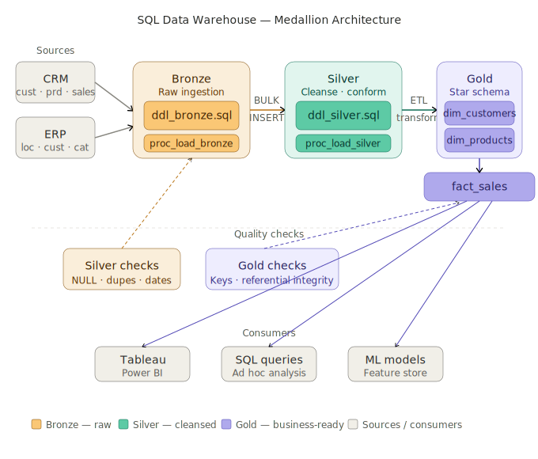

# Retail Data Warehouse — Medallion Architecture (SQL Server)
 
A portfolio project demonstrating how to design and build a SQL Server data warehouse using the Medallion Architecture (Bronze → Silver → Gold). Built on a realistic CRM and ERP dataset, it covers end-to-end ETL pipelines, data quality checks, dimensional modelling, and a star-schema analytical layer ready for BI tools.
 

 
---
 
## What's inside
 
| Layer | Purpose | Scripts |
|-------|---------|---------|
| **Bronze** | Raw ingestion from source CSV files via BULK INSERT | `ddl_bronze.sql`, `proc_load_bronze.sql` |
| **Silver** | Cleansed, conformed, deduplicated data with business rules applied | `ddl_silver.sql`, `proc_load_silver.sql` |
| **Gold** | Star-schema views ready for analytics and BI tools | `ddl_gold.sql` (dim_customers, dim_products, fact_sales) |
| **Tests** | SQL quality checks for Silver and Gold layers | `quality_checks_silver.sql`, `quality_checks_gold.sql` |
 
---
 
## Data sources
 
Two simulated source systems loaded from CSV:
 
- **CRM** — `cust_info`, `prd_info`, `sales_details`
- **ERP** — `CUST_AZ12`, `LOC_A101`, `PX_CAT_G1V2`
Raw files are in `datasets/source_crm/` and `datasets/source_erp/`.
 
---
 
## Repository structure
 
```
sql-data-warehouse/
├── datasets/
│   ├── source_crm/          # Raw CRM CSV files (customers, products, sales)
│   └── source_erp/          # Raw ERP CSV files (customers, locations, categories)
├── docs/
│   └── medallion_architecture.svg   # End-to-end architecture diagram
├── scripts/
│   ├── init_database.sql    # Creates DataWarehouse DB and bronze/silver/gold schemas
│   ├── bronze/
│   │   ├── ddl_bronze.sql         # Bronze table definitions
│   │   └── proc_load_bronze.sql   # Stored procedure: CSV → Bronze (BULK INSERT)
│   ├── silver/
│   │   ├── ddl_silver.sql         # Silver table definitions
│   │   └── proc_load_silver.sql   # Stored procedure: Bronze → Silver (cleanse & conform)
│   └── gold/
│       └── ddl_gold.sql           # Gold views: dim_customers, dim_products, fact_sales
└── tests/
    ├── quality_checks_silver.sql  # NULL checks, deduplication, date validation, consistency
    └── quality_checks_gold.sql    # Surrogate key uniqueness, referential integrity
```
 
---
 
## Getting started
 
### Prerequisites
- SQL Server (local or remote instance)
- SQL Server Management Studio (SSMS) or `sqlcmd`
- Login with permissions to create/drop databases and schemas
### 1. Initialise the warehouse
 
> ⚠️ This will drop and recreate a database named `DataWarehouse`. Back up any existing data first.
 
```bash
sqlcmd -S <server> -U <user> -P <password> -i scripts/init_database.sql
```
 
Or run `scripts/init_database.sql` directly in SSMS.
 
### 2. Create the Bronze tables
 
```sql
-- Run in SSMS against DataWarehouse
scripts/bronze/ddl_bronze.sql
```
 
### 3. Load Bronze from CSV
 
Update the file paths in `proc_load_bronze.sql` to match your local `datasets/` directory, then:
 
```sql
EXEC bronze.load_bronze;
```
 
### 4. Create and load Silver
 
```sql
scripts/silver/ddl_silver.sql
EXEC silver.load_silver;
```
 
The Silver procedure applies:
- Deduplication via `ROW_NUMBER()` on customer records
- Date validation and conversion (integer → DATE)
- Sales recalculation where values are inconsistent
- Gender and country code normalisation
- Future birthdate nullification
### 5. Create Gold views
 
```sql
scripts/gold/ddl_gold.sql
```
 
This creates three analytical objects:
- `gold.dim_customers` — customer dimension with surrogate key, joining CRM + ERP attributes
- `gold.dim_products` — product dimension with category hierarchy
- `gold.fact_sales` — sales fact table linking to both dimensions
### 6. Run quality checks
 
```sql
tests/quality_checks_silver.sql   -- Run after loading Silver
tests/quality_checks_gold.sql     -- Run after creating Gold views
```
 
All queries are written to return **zero rows on a clean load**. Any results indicate data issues to investigate.
 
---
 
## Data model
 
```
gold.fact_sales
    ├── product_key → gold.dim_products
    └── customer_key → gold.dim_customers
```
 
The Gold layer uses surrogate keys generated via `ROW_NUMBER() OVER (ORDER BY ...)` and filters out historical product records (`prd_end_dt IS NULL`) to expose only current products.
 
---
 
## Key transformations (Silver layer)
 
| Table | Transformation |
|-------|---------------|
| `crm_cust_info` | Deduplication — keeps latest record per `cst_id` |
| `crm_prd_info` | Derives `cat_id` from `prd_key`; calculates `prd_end_dt` using `LEAD()` |
| `crm_sales_details` | Converts integer dates to `DATE`; recalculates sales where `sales ≠ qty × price` |
| `erp_cust_az12` | Strips `NAS` prefix from CIDs; nullifies future birthdates |
| `erp_loc_a101` | Normalises country codes (`DE` → `Germany`, `US/USA` → `United States`) |
 
---
 
## Extending the project
 
- Add pipeline orchestration with Azure Data Factory, Airflow, or dbt
- Add columnstore indexes on `fact_sales` for large-scale query performance
- Connect `gold` views directly to Tableau or Power BI for dashboarding
- Extend the dataset with additional ERP or CRM source tables
---
 
## Author
 
**Amir Mohammadi** — [amir42.com](https://amir42.com) · [LinkedIn](https://www.linkedin.com/in/amir42com/) · [GitHub](https://github.com/amir42com)
